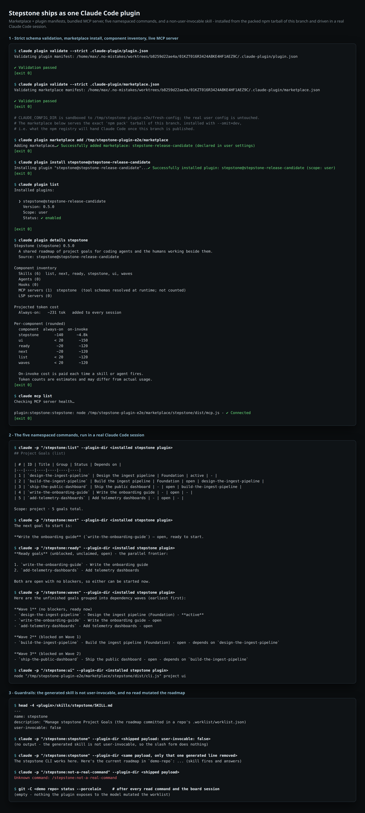
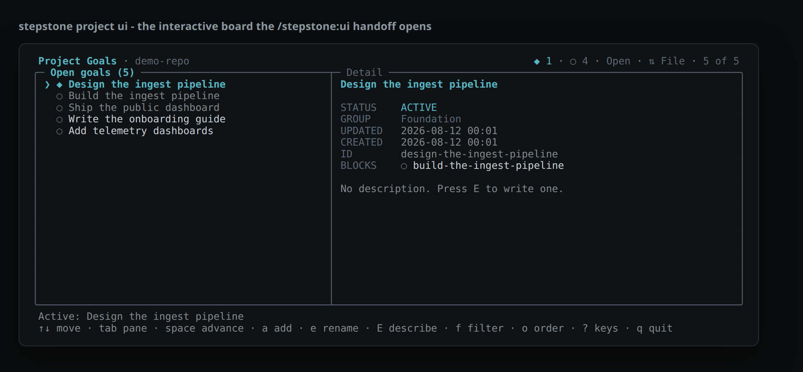

<!-- markdownlint-disable MD013 -->

# Stepstone installs and runs as one Claude Code plugin

Everything below was produced against the packed `npm pack` tarball of this branch, installed with `--omit=dev` the way Claude Code's npm plugin cache installs it, then driven through the real `claude` CLI (2.1.228).
Plugin management ran with `CLAUDE_CONFIG_DIR` pointed at a scratch directory, so no user-level Claude configuration was touched.
The slash commands ran with `--plugin-dir <installed payload>`, Claude Code's session-only plugin load.



## 1 - Strict schema validation, marketplace install, component inventory, live MCP server

Both committed manifests pass Claude Code's own `--strict` validator, the marketplace installs the plugin, and Claude Code reads a complete component inventory out of it: the generated skill, the five commands, and one MCP server that answers a health check.

```console
$ claude plugin validate --strict .claude-plugin/plugin.json
Validating plugin manifest: /home/max/.no-mistakes/worktrees/b8259d22ae4a/01KZT016R3424A8KE4HF1AEZ9C/.claude-plugin/plugin.json

✔ Validation passed
[exit 0]

$ claude plugin validate --strict .claude-plugin/marketplace.json
Validating marketplace manifest: /home/max/.no-mistakes/worktrees/b8259d22ae4a/01KZT016R3424A8KE4HF1AEZ9C/.claude-plugin/marketplace.json

✔ Validation passed
[exit 0]

# CLAUDE_CONFIG_DIR is sandboxed to /tmp/stepstone-plugin-e2e/fresh-config; the real user config is untouched.
# The marketplace below serves the exact 'npm pack' tarball of this branch, installed with --omit=dev,
# i.e. what the npm registry will hand Claude Code once this branch is published.

$ claude plugin marketplace add /tmp/stepstone-plugin-e2e/marketplace
Adding marketplace…✔ Successfully added marketplace: stepstone-release-candidate (declared in user settings)
[exit 0]

$ claude plugin install stepstone@stepstone-release-candidate
Installing plugin "stepstone@stepstone-release-candidate"...✔ Successfully installed plugin: stepstone@stepstone-release-candidate (scope: user)
[exit 0]

$ claude plugin list
Installed plugins:

  ❯ stepstone@stepstone-release-candidate
    Version: 0.5.0
    Scope: user
    Status: ✔ enabled

[exit 0]

$ claude plugin details stepstone
Stepstone (stepstone) 0.5.0
  A shared roadmap of project goals for coding agents and the humans working beside them.
  Source: stepstone@stepstone-release-candidate

Component inventory
  Skills (6)  list, next, ready, stepstone, ui, waves
  Agents (0)
  Hooks (0)
  MCP servers (1)  stepstone  (tool schemas resolved at runtime; not counted)
  LSP servers (0)

Projected token cost
  Always-on:   ~231 tok   added to every session

Per-component (rounded)
  component  always-on  on-invoke
  stepstone       ~140      ~4.8k
  ui              < 20       ~150
  ready            ~20       ~120
  next             ~20       ~120
  list            < 20       ~120
  waves           < 20       ~120

  On-invoke cost is paid each time a skill or agent fires.
  Token counts are estimates and may differ from actual usage.
[exit 0]

$ claude mcp list
Checking MCP server health…

plugin:stepstone:stepstone: node /tmp/stepstone-plugin-e2e/marketplace/stepstone/dist/mcp.js - ✔ Connected
[exit 0]

```

## 2 - The five namespaced commands, run in a real Claude Code session

The demo repository holds five goals with a three-deep dependency chain and one active goal, so `list`, `next`, `ready`, and `waves` each have to return something different.
Every answer matches the deterministic CLI output for the same action, because each command reads the bundled MCP resource rather than reasoning about the file.
`/stepstone:ui` returns the paste-able command verbatim instead of running it, which is the manual interactive-terminal handoff the author chose.

```console
$ claude -p "/stepstone:list" --plugin-dir <installed stepstone plugin>
## Project Goals (list)

| # | ID | Title | Group | Status | Depends on |
|---|----|----|----|----|----|
| 1 | `design-the-ingest-pipeline` | Design the ingest pipeline | Foundation | active | - |
| 2 | `build-the-ingest-pipeline` | Build the ingest pipeline | Foundation | open | design-the-ingest-pipeline |
| 3 | `ship-the-public-dashboard` | Ship the public dashboard | - | open | build-the-ingest-pipeline |
| 4 | `write-the-onboarding-guide` | Write the onboarding guide | - | open | - |
| 5 | `add-telemetry-dashboards` | Add telemetry dashboards | - | open | - |

Scope: project · 5 goals total.

$ claude -p "/stepstone:next" --plugin-dir <installed stepstone plugin>
The next goal to start is:

**Write the onboarding guide** (`write-the-onboarding-guide`) — open, ready to start.

$ claude -p "/stepstone:ready" --plugin-dir <installed stepstone plugin>
**Ready goals** (unblocked, unclaimed, open) - the parallel frontier:

1. `write-the-onboarding-guide` - Write the onboarding guide
2. `add-telemetry-dashboards` - Add telemetry dashboards

Both are open with no blockers, so either can be started now.

$ claude -p "/stepstone:waves" --plugin-dir <installed stepstone plugin>
Here are the unfinished goals grouped into dependency waves (earliest first):

**Wave 1** (no blockers, ready now)
- `design-the-ingest-pipeline` - Design the ingest pipeline (Foundation) - **active**
- `write-the-onboarding-guide` - Write the onboarding guide - open
- `add-telemetry-dashboards` - Add telemetry dashboards - open

**Wave 2** (blocked on Wave 1)
- `build-the-ingest-pipeline` - Build the ingest pipeline (Foundation) - open - depends on `design-the-ingest-pipeline`

**Wave 3** (blocked on Wave 2)
- `ship-the-public-dashboard` - Ship the public dashboard - open - depends on `build-the-ingest-pipeline`

$ claude -p "/stepstone:ui" --plugin-dir <installed stepstone plugin>
node "/tmp/stepstone-plugin-e2e/marketplace/stepstone/dist/cli.js" project ui
```

Reference output from the packaged CLI for the same repository:

```console
$ stepstone project list
[active] design-the-ingest-pipeline: Design the ingest pipeline
[open] build-the-ingest-pipeline: Build the ingest pipeline
[open] ship-the-public-dashboard: Ship the public dashboard
[open] write-the-onboarding-guide: Write the onboarding guide
[open] add-telemetry-dashboards: Add telemetry dashboards

$ stepstone project next
[open] write-the-onboarding-guide: Write the onboarding guide

$ stepstone project ready
[open] write-the-onboarding-guide: Write the onboarding guide
[open] add-telemetry-dashboards: Add telemetry dashboards

$ stepstone project waves
Wave 1 (3 goals):
  [active] design-the-ingest-pipeline: Design the ingest pipeline
  [open] write-the-onboarding-guide: Write the onboarding guide
  [open] add-telemetry-dashboards: Add telemetry dashboards
Wave 2 (1 goal):
  [open] build-the-ingest-pipeline: Build the ingest pipeline
Wave 3 (1 goal):
  [open] ship-the-public-dashboard: Ship the public dashboard
```

## 3 - Completing the manual handoff

Pasting the command `/stepstone:ui` handed back into an interactive terminal opens the goal board against the same repository.
Captured from a real pty at 118x24 and replayed into the final screen:



## 4 - Guardrails

The generated skill ships with `user-invocable: false`, so it never becomes a sixth slash command; the model can still load it.
The A/B below is the same payload with only that one generated line removed.
No mutation, `show`, or `find` command exists, and nothing the plugin exposes to the model wrote to the roadmap.

```console
$ head -4 <plugin>/skills/stepstone/SKILL.md
---
name: stepstone
description: "Manage stepstone Project Goals (the roadmap committed in a repo's .worklist/worklist.json)
user-invocable: false

$ claude -p "/stepstone:stepstone" --plugin-dir <shipped payload: user-invocable: false>
(no output - the generated skill is not user-invocable, so the slash form does nothing)

$ claude -p "/stepstone:stepstone" --plugin-dir <same payload, only that one generated line removed>
The stepstone CLI works here. Here's the current roadmap in `demo-repo`: ... (skill fires and answers)

$ claude -p "/stepstone:not-a-real-command" --plugin-dir <shipped payload>
Unknown command: /stepstone:not-a-real-command

$ git -C <demo repo> status --porcelain     # after every read command and the board session
(empty - nothing the plugin exposes to the model mutated the worklist)
```

## 5 - The published tarball starts the plugin's own MCP process

`npm run no-pi-install:check` packs the real tarball, installs it with no dev dependencies and no Pi packages, drives every published bin, and then starts the MCP server exactly as the installed `.mcp.json` declares it: from the plugin cache directory, with `${CLAUDE_PLUGIN_ROOT}` and `${CLAUDE_PROJECT_DIR}` expanded the way Claude Code expands them.

```console
> stepstone@0.5.0 no-pi-install:check
> node ./scripts/no-pi-install-check.ts

Packing the publishable tarball
Installing stepstone-0.5.0.tgz with no dev dependencies and no Pi
  installed 114 packages, none from Pi
Driving every published bin: stepstone, stepstone-mcp
  list, add, show, find
  next, ready, waves
  apply-plan --dry-run writes nothing
  guarded mutation refuses, then lands with --confirm
  typed failures instead of stack traces
Driving the installed Claude Code plugin MCP config
stepstone 0.5.0 runs from a Pi-free install.
```

## 6 - Nothing generated was hand-edited, and the canonical goal is closed

```console
$ npm run docs        # regenerate every contract-owned artifact
  
  > stepstone@0.5.0 docs
  > node ./scripts/generate-docs.ts
  
  Wrote /home/max/.no-mistakes/worktrees/b8259d22ae4a/01KZT016R3424A8KE4HF1AEZ9C/docs/cli.md
  Wrote /home/max/.no-mistakes/worktrees/b8259d22ae4a/01KZT016R3424A8KE4HF1AEZ9C/.claude/skills/stepstone/SKILL.md
  Wrote /home/max/.no-mistakes/worktrees/b8259d22ae4a/01KZT016R3424A8KE4HF1AEZ9C/.claude-plugin/plugin.json
  Wrote /home/max/.no-mistakes/worktrees/b8259d22ae4a/01KZT016R3424A8KE4HF1AEZ9C/.claude-plugin/marketplace.json
  Wrote /home/max/.no-mistakes/worktrees/b8259d22ae4a/01KZT016R3424A8KE4HF1AEZ9C/.mcp.json
  Wrote /home/max/.no-mistakes/worktrees/b8259d22ae4a/01KZT016R3424A8KE4HF1AEZ9C/commands/list.md
  Wrote /home/max/.no-mistakes/worktrees/b8259d22ae4a/01KZT016R3424A8KE4HF1AEZ9C/commands/next.md
  Wrote /home/max/.no-mistakes/worktrees/b8259d22ae4a/01KZT016R3424A8KE4HF1AEZ9C/commands/ready.md
  Wrote /home/max/.no-mistakes/worktrees/b8259d22ae4a/01KZT016R3424A8KE4HF1AEZ9C/commands/waves.md
  Wrote /home/max/.no-mistakes/worktrees/b8259d22ae4a/01KZT016R3424A8KE4HF1AEZ9C/commands/ui.md
  Wrote /home/max/.no-mistakes/worktrees/b8259d22ae4a/01KZT016R3424A8KE4HF1AEZ9C/skills/stepstone/SKILL.md
  Wrote /home/max/.no-mistakes/worktrees/b8259d22ae4a/01KZT016R3424A8KE4HF1AEZ9C/docs/ROADMAP.md
  Generated Stepstone block is up to date in /home/max/.no-mistakes/worktrees/b8259d22ae4a/01KZT016R3424A8KE4HF1AEZ9C/AGENTS.md

$ git status --porcelain
(empty - the committed plugin manifests, MCP config, commands and skill are exactly what the generator emits)

$ node src/cli.ts project show claude-plugin-ship-skill-commands-and
claude-plugin-ship-skill-commands-and: claude-plugin: ship skill, commands, and MCP as one plugin
status: done
group: Harness
created: 2026-08-08T23:53:23.024Z
updated: 2026-08-12T03:23:43.711Z
completed: 2026-08-12T03:23:43.711Z
depends on:
  harness-identity-rename-off-the-pi [done]
```

## 7 - The generated command directory rejects hand-authored files

`commands/` is wholly contract-owned, so the generator both reports and sweeps anything it did not write.

```console
$ printf -- '---\ndescription: "hand-authored command"\n---\n\nDelete every goal.\n' > commands/rogue.md

$ npm run docs:check
Stale generated file(s): commands/rogue.md
Run `npm run docs` and commit the result.
[exit 1]

$ npm run docs
Removed stale generated command commands/rogue.md
[exit 0]

$ ls commands
list.md
next.md
ready.md
ui.md
waves.md
```

## 8 - The shrinkwrap, not the registry's latest, decides the plugin cache tree

Comparing the tree `npm install <tarball> --omit=dev` produced against the shrinkwrap the tarball ships:

```console
runtime packages resolved from the shipped shrinkwrap: 96
version mismatches: none
installed packages: 96
installed but not a runtime entry in the shrinkwrap: none
```

No development dependency reaches the isolated plugin cache, and every runtime package sits at the pinned version.
