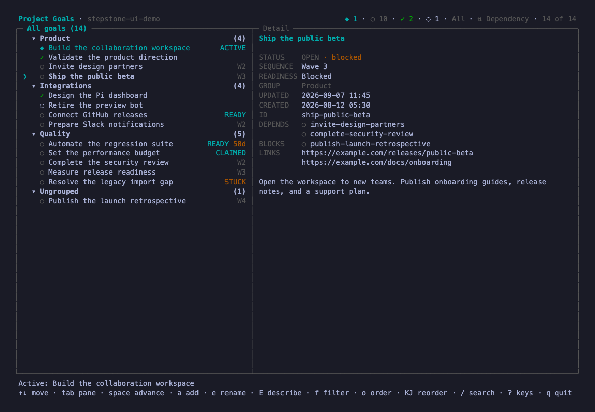
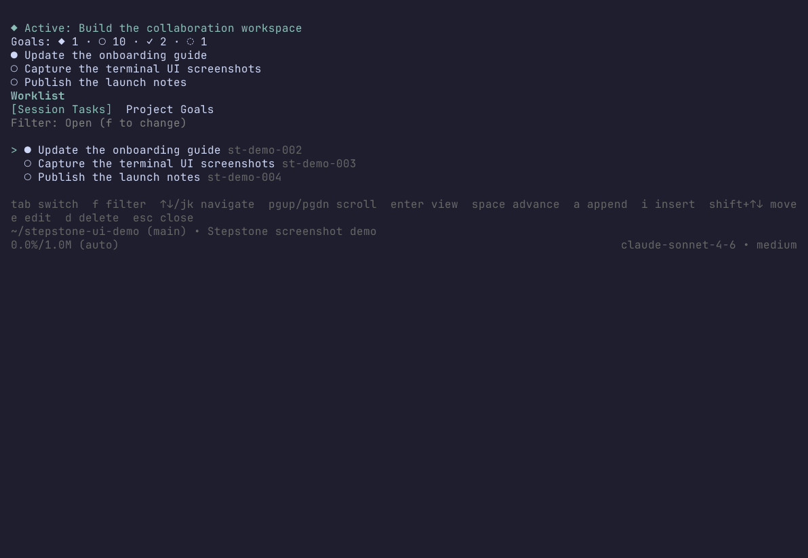

<!-- markdownlint-disable MD013 MD034 -->

# stepstone

[](https://www.npmjs.com/package/stepstone)
[](https://github.com/max-miller1204/stepstone/actions/workflows/ci.yml)
[](https://github.com/max-miller1204/stepstone/actions/workflows/release.yml)

stepstone organizes projects, milestones, and tasks.
A project is a larger effort. A milestone is a meaningful outcome. A task is actionable work.
Projects can have no repository or link to several repositories.
Existing Project Goals become tasks with the same IDs, dependencies, and history. The existing CLI and boards remain compatible.
Read the [organization guide](docs/organization.md) to configure a project and assign tasks to milestones.

A repository roadmap stays committed alongside the code. An effort outside Git uses an explicit store.
Task dependencies let `next`, `ready`, and `waves` show what to start, what can run in parallel, and what each finished task unblocks.

## Interfaces

Run `npx -y stepstone@latest project web` from the main worktree to open the local web application. Use it to manage goals, dependencies, and roadmap order.

Run `npx -y stepstone@latest project ui` to open the Project Goal board. This view uses dependency order.



Install the Pi extension and run `/tasks` to open the Stepstone dashboard in Pi.



### Branch claims

Stepstone tracks goals, dependencies, branch claims, and pull request links. Create and manage worktrees with Git or external tools. Complete goals through an explicitly confirmed lifecycle command.

Workspace commands have been removed. Read the [migration guide](docs/workspaces.md) to inspect preserved resources and update existing scripts.

## Install

**Agent Skill.**
Install the [standalone Agent Skill](docs/skill.md) when your coding agent supports the [`skills` CLI](https://github.com/vercel-labs/skills):

```sh
npx skills add max-miller1204/stepstone --skill stepstone -g
```

The skill teaches the agent the full workflow and invokes the CLI from npm when needed.
Drop `-g` to install it only for the current project.

**Any shell, script, or coding agent.**
There is nothing to install. Run the CLI from npm on demand in any Git repository with Node:

```sh
npx -y stepstone@latest project list
```

**Optional shell completion.**
Install the package globally to use the packaged Bash or Zsh completion script:

```sh
npm install stepstone --global
stepstone completion install
```

Restart the shell after installation.
See [docs/usage.md](docs/usage.md#shell-completion) for paths and requirements.

**[Pi](https://pi.dev) extension.**
Install the [extension](docs/pi.md) when you want `/tasks`, a session widget, a model-facing tool, and Session Tasks:

```sh
pi install npm:stepstone
```

The npm package and Agent Skill are separate installations.
The package provides the CLI and Pi extension. The skill provides guidance that a harness loads from its skills directory.
See [docs/skill.md](docs/skill.md) for details.

## Try it

```sh
npx -y stepstone@latest project add Replace legacy authentication \
  --description "Migrate every supported client first"
# Added project goal replace-legacy-authentication: Replace legacy authentication

npx -y stepstone@latest project add Retire the legacy auth service \
  --depends-on replace-legacy-authentication

npx -y stepstone@latest project waves
# Wave 1 (1 goal):
#   [open] replace-legacy-authentication: Replace legacy authentication
# Wave 2 (1 goal):
#   [open] retire-the-legacy-auth-service: Retire the legacy auth service

npx -y stepstone@latest project set_active replace-legacy-authentication
```

`add` prints the ID it minted from the title, and that is the name every other command takes; the ID is frozen, so renaming the goal later never invalidates a reference to it.
`waves` reads the dependency edge rather than the file order, which is why retiring the old service sits in a later layer than replacing it, and `next` names the one goal to start right now.
All of it lands in `.worklist/worklist.json` at the repository root, which is meant to be committed.

Add `--json` to any command for a deterministic result envelope instead of prose, which is how agents and scripts should read it.
Run `npx -y stepstone@latest project ui` for a full-screen [terminal board](docs/board.md) over the same goals.

## Documentation

| Document | Contents |
| --- | --- |
| [docs/how-it-works.md](docs/how-it-works.md) | Goal identity, lifecycle, dependency state, persistence, and executable boundaries |
| [docs/usage.md](docs/usage.md) | Running the CLI: reads, writes, `--json` envelopes, exit codes, conflicts |
| [docs/cli.md](docs/cli.md) | Generated `project` command reference: every action, flag, and rule |
| [docs/goals.md](docs/goals.md) | The goal model: fields, statuses, IDs, order, groups, JSON plans |
| [docs/dependencies.md](docs/dependencies.md) | Dependency edges and the sequencing reads behind `next`, `ready`, and `waves` |
| [docs/workspaces.md](docs/workspaces.md) | Migrating from removed workspace commands and inspecting preserved resources |
| [docs/web.md](docs/web.md) | The loopback web application, its workflows, and its security boundary |
| [docs/storage.md](docs/storage.md) | Where the goal file lives, its schema, locking, revisions, and migrations |
| [docs/board.md](docs/board.md) | The terminal goal board and its key map |
| [docs/skill.md](docs/skill.md) | The standalone generated Agent Skill and how to install it |
| [docs/pi.md](docs/pi.md) | The Pi extension: Session Tasks, `/tasks`, the widget, the model tool, the module API |
| [docs/ROADMAP.md](docs/ROADMAP.md) | This repository's own Project Goals, generated from the goal file it commits |
| [docs/development.md](docs/development.md) | Working on stepstone: checks, generated files, and the invariants behind them |
| [docs/releasing.md](docs/releasing.md) | How a release is published, and the one-time registry setup |

## Pi extension

Pi is one supported harness rather than the product.
In a Pi session, stepstone adds Session Tasks: a branch-aware queue of the concrete chunks in the session at hand, kept separate from the roadmap because a session's next steps and a repository's outcomes are not the same thing.
It also adds the `/tasks` dashboard over both lists, a compact widget naming the active goal and the next unfinished tasks, and a model-facing `worklist` tool.

Session Tasks are documented and kept working, but they are not where the project is heading: new work goes into Project Goals and the interfaces every harness can reach.
[docs/pi.md](docs/pi.md) covers installation, the dashboard, the direct commands, Session Task storage, the model tool, and importing the application service from another extension.

## Development

```sh
git clone https://github.com/max-miller1204/stepstone.git
cd stepstone
mise install
mise exec -- npm ci
mise exec -- npm run check
```

[docs/development.md](docs/development.md) covers the rest, including the generated files that must never be hand-edited.

## Formerly pi-worklist

stepstone was published as `pi-worklist` through 0.17.0, which is frozen and no longer updated.
Everything continues here, under a name that does not imply the tool only serves one coding agent.

## License

MIT
