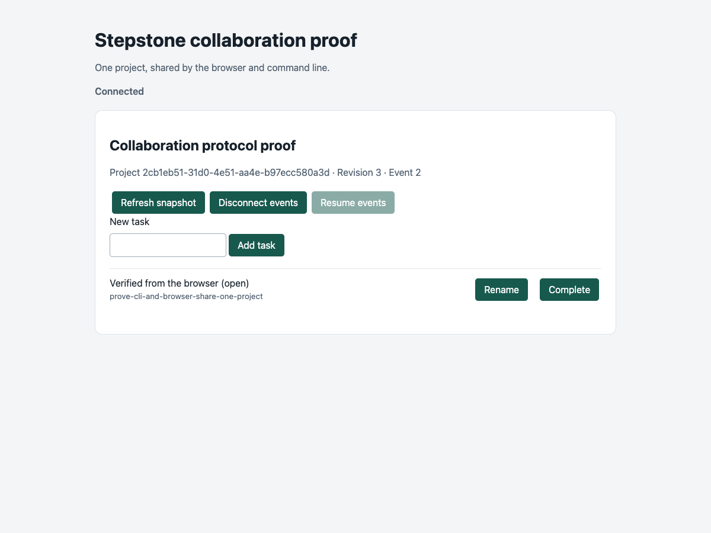

<!-- markdownlint-disable MD013 -->

# Collaboration protocol decision

Status: accepted for the wave 4 protocol proof. The next wave owns the full authoritative collaboration service and migration of existing interfaces.

## Decision

One server owns each collaboration project. CLI, browser, and agent clients send commands to that server. Clients do not read or write its storage. Local and shared deployments use the same protocol and server implementation. A local deployment uses a local server address. A shared deployment uses a configured remote address.

Repository paths, Git origins, branches, and worktrees are optional project context. They do not establish identity, select storage, or grant permission. A project can exist without a repository. Moving a checkout does not move the project or change its identity.

A configured server is required for every collaboration operation. An unavailable server produces an explicit error. The client does not switch to a file store. The protocol does not execute workspaces, launch agents, or manage Git resources.

## Boundary with existing Stepstone state

The proof uses a separate collaboration store. Initialization requires explicit confirmation. It can initialize an empty store or adopt a disposable copy of an existing worklist. Adoption preserves the file model and identity history while it assigns immutable server identities. Do not initialize the canonical roadmap as a proof store. Its task commands reuse `WorklistApplicationService` and `src/project-mutations.ts` inside a staged transaction. Existing Project Goal operations continue through these same domain boundaries. Their cross-process lock, atomic replacement, location resolution, and lifecycle confirmation remain required. Session Tasks remain versioned, branch-aware Pi custom-entry snapshots.

The proof demonstrates a narrow project task workflow. It does not replace the published project CLI, the existing local goal editor, or the Pi extension. The shared command contract is the boundary that later CLI and agent integration must use. No client receives a storage-writing exception.

## Identity

Projects, tasks, and actors have immutable IDs. A task belongs to one immutable project ID. Human-facing task IDs are project-scoped references, separate from task identity. A title edit changes neither identity nor the task's current reference.

Former task IDs continue to resolve to the same task. Removed task IDs remain retired and cannot identify a new task. Migration must preserve current IDs, former IDs, retired IDs, dependency references, and historical references. It must not mint identity from a title, repository path, Git origin, branch, or worktree.

Production migration of existing worklists is a separate operation for the full service. Proof adoption of a disposable copy does not supply that migration workflow. It must explicitly map each worklist and stored task to immutable identity. Existing `findGoalByStoredId` and `migrateProjectGoalIds` rules remain authoritative for the file model until that migration occurs.

## Actors and permissions

An authenticated credential selects a stable actor ID. The client cannot choose a different actor by adding a field to a command. The server checks the actor's project role before it returns protected state or executes a command.

The proof uses configured bearer credentials. A `reader` can read snapshots and events. An `editor` can create, edit, complete, reopen, and archive tasks. An `owner` can also initialize the store and delete tasks. It does not provide account registration, credential recovery, or an identity provider. Shared production operation needs managed credentials, encrypted transport, and an explicit membership administration contract. These requirements belong to the full service.

## Command contract

Commands carry `version: 1`, a `commandId` idempotency key, a `projectId`, an `expectedRevision`, and an `action` with its typed operation fields. The version is an explicit compatibility boundary. Unknown versions and invalid payloads fail before mutation.

The expected revision is mandatory. The server compares it with current state while it holds the write transaction. A stale command returns a conflict and leaves state unchanged. Clients must read current state before they prepare a replacement command. The protocol does not merge stale edits automatically.

Lifecycle operations require explicit confirmation. A client must collect that confirmation before it sends the lifecycle command. Server-side validation must reject missing confirmation even when the client has permission to edit the task.

## Atomic commit and retry

A successful command commits the new state, the ordered event, and its stored result as one transaction. The proof stages domain mutations under the existing cross-process lock, then writes one file replacement that includes state, events, and receipts. A process interruption must not expose a state change without its event or lose the result needed to identify a retry. This file proof does not establish power-loss durability or database availability guarantees. Concurrent writers must not commit against the same expected revision.

The server scopes command IDs to a project and binds each recorded command to its authenticated actor. A retry by the same actor with the same key and command content returns the original result. It must not apply the command twice. Reuse of the key with different content or a different actor is an error. A transport timeout does not prove that a command failed. The client can retry the exact command with its original key to resolve that uncertainty.

Only successful commands receive a stored result. Validation failures and conflicts leave no receipt. An accepted command advances the aggregate revision and appends an event even when the domain edit is a semantic no-op. This records command acceptance without changing the task identity or its domain timestamps. A new user action uses a new key. A command rebuilt after a revision conflict also uses a new key. Clients must not silently change the payload of a pending command.

## Snapshots and ordered events

Events have a monotonic sequence within their project. The sequence provides project order, not a global order across projects. An event identifies its project, command, actor, revision, and change.

A proof snapshot contains project metadata, all tasks, retired IDs, and its event cursor at one committed revision. Milestone records remain in storage but are outside this proof projection. Clients read a snapshot, then request events after that cursor. This order closes the gap between the initial read and the live subscription. An event stream cannot substitute for the initial snapshot.

SSE carries the event cursor in each event ID. A reconnect supplies the last processed cursor through `Last-Event-ID`. The server replays later retained events in order before it continues live delivery. Clients must tolerate repeated delivery and apply only events beyond their processed cursor. The proof browser treats each new event as an invalidation and fetches a complete snapshot. Events do not carry a full task patch.

The proof retains all events and receipts. An invalid cursor or a cursor ahead of the server returns `SNAPSHOT_REQUIRED`. A future retention policy must also reject a cursor older than retained history explicitly. When the server requires a new snapshot, the client must discard its stale read model and establish a new cursor from that snapshot. This is an explicit protocol recovery step. It does not switch storage authority.

## Proof entry point

`scripts/collaboration-proof.ts` is a source-only entry point for `init`, `serve`, `snapshot`, and `command`. Run it with the pinned toolchain through `mise exec -- node`. It is not a published executable.

Create a disposable proof store:

```sh
mise exec -- node scripts/collaboration-proof.ts init /tmp/stepstone-proof.json "Collaboration proof" --confirm
```

Create a private configuration file with a fresh random token:

```json
{
  "store": "/tmp/stepstone-proof.json",
  "host": "127.0.0.1",
  "port": 4318,
  "credentials": [
    { "token": "REPLACE_WITH_A_RANDOM_TOKEN", "actor": { "id": "local-owner", "role": "owner" } }
  ]
}
```

Start the server with `mise exec -- node scripts/collaboration-proof.ts serve <config.json>`. Open its printed URL in a browser. Enter the configured token. In a separate terminal, set `STEPSTONE_SERVER` to that URL and `STEPSTONE_TOKEN` to that token. Run `mise exec -- node scripts/collaboration-proof.ts snapshot` to read the project ID and revision.

The `command <command.json>` action reads a command from a file. An add command has this shape:

```json
{
  "version": 1,
  "commandId": "a3b3f577-3e19-49ed-9cd1-a85b728bf847",
  "projectId": "REPLACE_WITH_SNAPSHOT_PROJECT_ID",
  "expectedRevision": 1,
  "action": "add",
  "title": "Verify shared state"
}
```

Use a new UUID for each command. Copy the current project ID and revision from the snapshot. Run `mise exec -- node scripts/collaboration-proof.ts command <command.json>`. Use the returned immutable `taskId` for later task commands.

The server reads explicit configuration for its store, bind address, port, and actor credentials. The CLI client uses `STEPSTONE_SERVER` and `STEPSTONE_TOKEN`. The browser runs from the same server and accepts a credential from its user. CLI and browser requests use the same command contract.

Use a loopback bind address for local operation. Shared operation requires encrypted transport through a trusted reverse proxy and the configured public origin. A shared address does not enable account management or make the proof a production service.



The captured task was created by the proof CLI and renamed in the browser. The CLI then read revision 3 with the same immutable task ID.

## Proof and acceptance evidence

The proof must show both clients using one server and one project. It must demonstrate:

1. Create a task with the CLI and observe it in the browser.
2. Edit the task through the browser and read the new revision with the CLI.
3. Reject an edit prepared from a stale revision without changing state.
4. Retry an accepted command without a second mutation or event.
5. Reject reuse of an idempotency key with different content.
6. Disconnect and resume SSE without losing ordered changes.
7. Preserve state, events, and retry results across server restart.
8. Reject unauthorized writes and unconfirmed lifecycle changes.
9. Preserve former and retired task references.
10. Fail explicitly when the configured server is unavailable.

Automated assertions prove protocol behavior. An inspected browser capture proves the visible client runs against the proof server. Neither form of evidence implies that the full production collaboration service is complete.

## Deferred work

The next wave owns the complete authoritative service. Its work includes migration from existing worklists, full domain operation coverage, production persistence, account and membership administration, deployment, and operational policy. The next wave uses PostgreSQL transactions, OIDC users, and scoped service credentials. The proof does not select a deployment vendor or establish production readiness.

Milestones, dependency editing, cross-project behavior, full agent integration, and richer browser workflows must use the same authority and transaction boundaries when they are added. A workspace execution protocol remains outside this decision.
