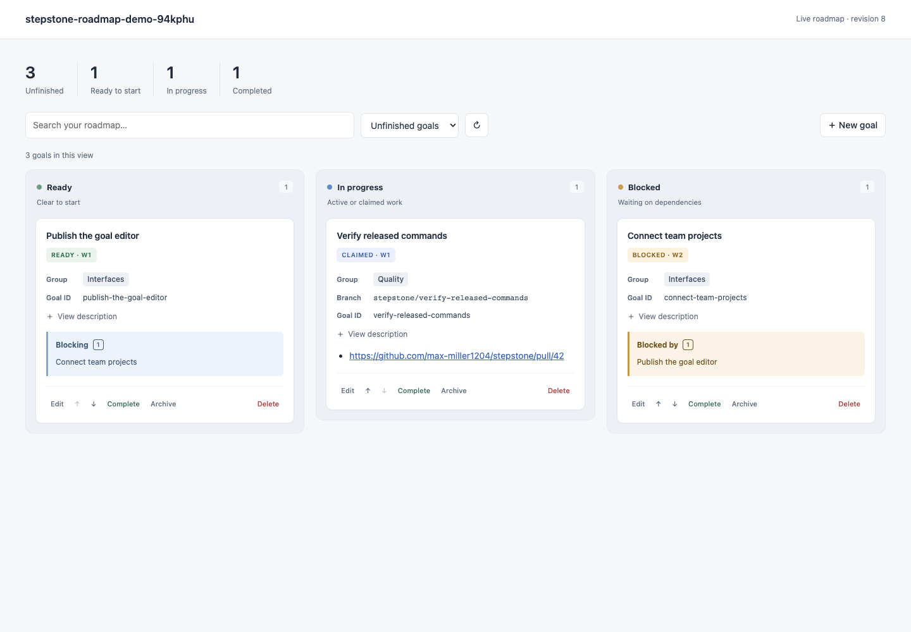

# Local goal editor

Run the local web application from the repository's main worktree:

```sh
npx -y stepstone@latest project web
```

Stepstone opens the editor in your default browser. Use `--no-open` to print the URL. Use `--port <number>` to select a loopback port. Port `0` selects an available port.

The roadmap opens as a Kanban board with Ready, In progress, and Blocked columns. Active and claimed goals appear in In progress. The status filter also exposes Completed and Archived columns. Counts summarize the full roadmap. Search and filters narrow the cards. On small screens, scroll horizontally between columns.

Select a card to read its description, dependencies, branch, and recorded links. Claimed cards show the recorded branch. Links, including pull request links, appear on cards and in goal details. These records come from the roadmap. The editor does not inspect workspace activity or fetch pull request status.

Use the editor to:

- Create and edit goals.
- Set groups, links, and dependencies.
- Review blocked goals and dependency waves.
- Change the canonical goal order.
- Complete, reopen, archive, or delete a goal after confirmation.

Claimed goals remain editable. Editing roadmap data can change the claim timestamp. Before further workspace operations, use the CLI to inspect the claim and resolve any conflict. A browser lifecycle action does not reconcile or clean a workspace.

The header identifies the repository and roadmap revision. Use Refresh to read changes made by another agent or terminal. Stale edits and stale ordering requests fail with a conflict. Refresh before you retry.

Workspace preparation, dispatch runs, recovery, reconciliation, and cleanup belong to the [workspace CLI](workspaces.md). The editor has no workspace controls or endpoints. Loading the board does not read dispatch journals or inspect workspaces.



## Security boundary

The server binds only to `127.0.0.1`. It checks the HTTP `Host` header on every request. Each server process creates a random mutation token and puts it in the served page. A mutation must provide this token and the exact same-origin `Origin` header.

The server accepts bounded JSON request bodies. Browser code does not read or write the goal file. Goal mutations use `WorklistApplicationService`, domain validation, optimistic checks, the cross-process lock, and atomic file replacement. Lifecycle changes require explicit confirmation.

Run the editor only from the main worktree. It rejects `--file` and non-empty `STEPSTONE_WORKLIST` overrides. Unset `STEPSTONE_WORKLIST` before starting. The editor resolves the canonical roadmap for each operation. Prepared linked worktrees remain read-only for roadmap mutations.

The loopback editor is the transition to a server-backed application. It does not expose a network service, launch agents, create workspaces, or create or merge pull requests.
